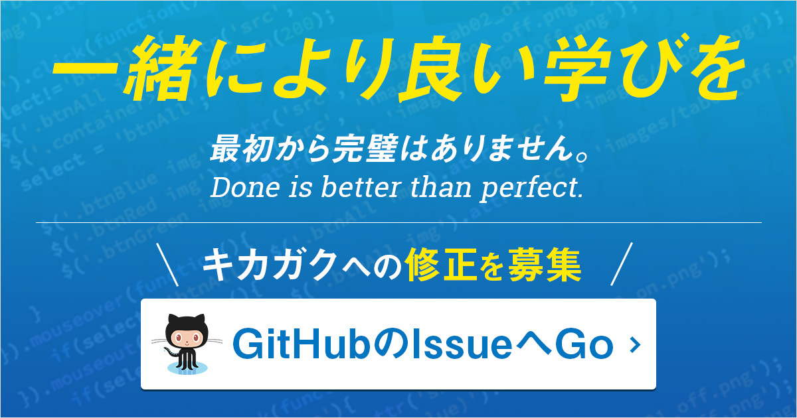

# kikagaku-public-issues

https://www.kikagaku.ai

この度は「キカガク」へご登録し、学習を進めていただき誠にありがとうございます。  
「キカガク」に携わっているメンバー全員から、皆様へ心より感謝申し上げます。  

学習を進めていく中で、疑問点や表記ミス、テストの回答ミスなどがあった場合、お手数ですがこちらのレポジトリへ Issues として投稿いただければ幸いです。  
より良い学習プラットフォームになるように、皆様と一緒にキカガクを進化させていきたいと思っております。  

それでは、皆様からの e-ラーニングプラットフォーム「キカガク」への Issues をお待ちしております！

## Issues の取り扱いについて

原則、投稿を頂いた内容から順に対応していきます。  
Issues によっては対応に時間がかかることもあるかと存じますが、しっかりとアップデートしていきますので、お待ちしていただければ幸いです。
