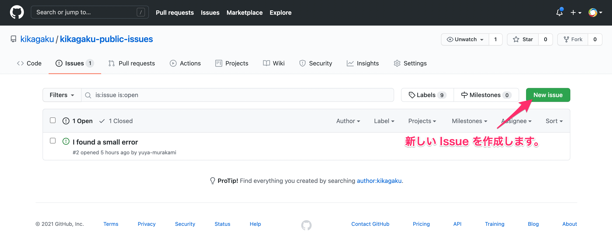

# 修正を随時受け付けています

講座内容の修正事項や Typo に関する問い合わせはこちらの **Issues** で受け付けていますので、お気軽にお問い合わせください。対応が必要な Issue に関して順次対応いたします。なお、テストの質問に対する解答や、講座内容への質問には対応いたしかねますので、ご了承ください。

みなさまと一緒に、キカガクをより良い学習プラットフォームにできるようキカガク社員一同尽力してまいります。

## 手順

**Step 1**

**Step 2**

**Step 3**

